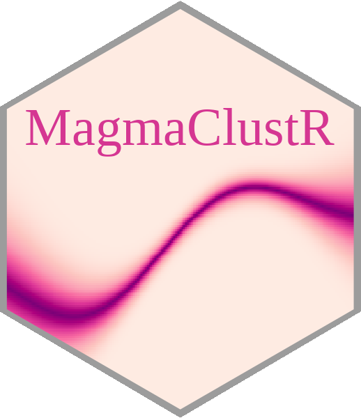

<!-- README.md is generated from README.Rmd. Please edit that file -->

```{r, include = FALSE}
knitr::opts_chunk$set(
  collapse = TRUE,
  comment = "#>",
  fig.path = "man/figures/README-",
  fig.align = 'center',
  dpi = 300,
  out.width = "80%"
)
```

# MagmaClustR 

<!-- badges: start -->
[](https://github.com/ArthurLeroy/MagmaClustR/actions/workflows/R-CMD-check.yaml)
[](https://CRAN.R-project.org/package=MagmaClustR)
[](https://lifecycle.r-lib.org/articles/stages.html#stable)
[](https://app.codecov.io/gh/ArthurLeroy/MagmaClustR)
<!-- badges: end -->

The *MagmaClustR* package implements two main algorithms, called Magma (*Leroy et al., 2022*) and MagmaClust (*Leroy et al., 2020*), using a multi-task Gaussian processes (GP) model to perform predictions for supervised learning problems. Applications involving functional data, such as multiple time series, are particularly well-handled. Theses approaches leverage the learning of cluster-specific mean processes, which are common across similar tasks, to provide enhanced prediction performances (even far from data points) at a linear computational cost (in the number of tasks). MagmaClust is a generalisation of Magma where the tasks are simultaneously clustered into groups, each being associated to a specific mean process. User-oriented functions in the package are decomposed into training, prediction and plotting functions. Some basic features of standard GPs are also implemented.

Leroy, A., Latouche, P., Guedj, B., Gey, S. MAGMA: inference and prediction using multi-task Gaussian processes with common mean. *Mach Learn* **111**, 1821–1849 (2022). https://doi.org/10.1007/s10994-022-06172-1

Leroy, A., Latouche, P., Guedj, B., & Gey, S. Cluster-Specific Predictions with Multi-Task Gaussian Processes. *JMLR* 24(5):1−49, (2023). https://www.jmlr.org/papers/v24/20-1321.html

## Installation

You can install the released version of MagmaClustR from [CRAN](https://CRAN.R-project.org) with:

``` r
install.packages("MagmaClustR")
```

And the development version from [GitHub](https://github.com/) with:

``` r
# install.packages("devtools")
devtools::install_github("ArthurLeroy/MagmaClustR")
```
## Example: Magma

Here is a basic example on how to simulate a dataset with the adequate format, then train a Magma model and use it to perform predictions.

### Data generation
```{r generate data Magma}
library(MagmaClustR)
## Simulate a dataset with 11 individuals, each observed at 10 input locations
set.seed(17)
data_magma <- simu_db(M = 11, N = 10, common_input = FALSE)
## Split individuals into training and prediction sets, and define test points
magma_train <- data_magma %>% subset(ID %in% 1:10)
magma_pred <- data_magma %>% subset(ID == 11) %>% head(7)
magma_test <- data_magma %>% subset(ID == 11) %>% tail(3)

data_magma
```
As displayed above, any dataset processed in MagmaClustR should provide columns named `ID`, `Input`, and `Output`. Any additional column would be treated as a covariate (and thus define multi-dimensional inputs). 

### Training and prediction with Magma 

```{r train_and_predict_Magma}
model <- train_magma(data = magma_train, common_hp = F)

pred  <- pred_magma(data = magma_pred,
                    trained_model = model, 
                    grid_inputs = seq(0,10, 0.01))
```

Note that the `common_hp` and `grid_inputs` arguments are optional. They respectively indicate that a specific set of hyper-parameters is trained for each curve, and control the grid of values on which the prediction is performed.

### Display the resulting predictions

Several other arguments are available in dedicated plotting functions to offer extended options in the display of results. For instance, the GP predictions can be represented as a heatmap of probabilities:

```{r display_Magma}
plot_gp(pred_gp = pred,
        data = magma_pred,
        data_train = magma_train,
        prior_mean = model$hyperpost$mean,
        heatmap = TRUE) 
```

Additionally, it is also possible to create animated representations by using functions that generate GIFs. For instance, below, the true testing points have been represented as red dots and we can observe how the prediction evolves as we add more data points to our prediction dataset.

```{r gif_Magma, message=FALSE}

pred_gif  <- pred_gif(data = magma_pred,
                      trained_model = model,
                      grid_inputs = seq(0, 10, 0.01))

plot_gif(pred_gp = pred_gif,
         data = magma_pred,
         data_train = magma_train,
         prior_mean = model$hyperpost$mean) + 
  ggplot2::geom_point(data = magma_test,
                      ggplot2::aes(x = Input, y = Output),
                      color = 'red', size = 2)
```

## Example: MagmaClust

Here is a basic example on how to simulate a dataset with the adequate format, then train a MagmaClust model and use it to perform simultaneous clustering and predictions.

### Data generation

```{r generate data MagmaClust}
## Simulate a dataset containing 3 clusters of 4 individuals, each observed at 10 input locations
set.seed(4) 
data_magmaclust <- simu_db(M = 4, N = 10, K = 3, common_input = FALSE) 
## Split individuals into training and prediction sets, and define test points
list_ID = unique(data_magmaclust$ID)
magmaclust_train <- data_magmaclust %>% subset(ID %in% list_ID[1:11])
magmaclust_pred <- data_magmaclust %>% subset(ID == list_ID[12]) %>% head(5)
magmaclust_test <- data_magmaclust %>% subset(ID == list_ID[12]) %>% tail(5)

data_magmaclust
```


### Training and prediction with MagmaClust

```{r train_and_predict_MagmaClust, message=FALSE}
model_clust <- train_magmaclust(data = magmaclust_train)

pred_clust  <- pred_magmaclust(data = magmaclust_pred,
                               trained_model = model_clust,
                               grid_inputs = seq(0, 10, 0.01), 
                               plot = FALSE)
```


### Display the resulting predictions

As before, a specific plotting function is provided. For MagmaClust, we advise to use the heatmap representation in priority, as a mixture of GPs may not be unimodal in general (and thus prevents the definition of Credible Interval).

```{r display_MagmaClust, message=FALSE}
## Allocate individuals to their most probable cluster to colour them by clusters afterwards
data_train_with_clust = data_allocate_cluster(model_clust)

plot_magmaclust(pred = pred_clust,
                cluster = "all",
                data = magmaclust_pred,
                data_train = data_train_with_clust,
                col_clust = TRUE,
                prior_mean = model_clust$hyperpost$mean,
                y_grid = seq(10, 55, 0.5),
                heatmap = TRUE) 
```

## Example: in 2-dimensions

Although unidimensional-input problems are easier to visualise, both Magma and MagmaClust can also be applied with as many covariates as desired in the model.

### Data generation
```{r generate data 2-D}
## Dataset with 11 individuals, 10 reference input locations and a covariate
set.seed(5) 
data_dim2 <- simu_db(M = 11, N = 10, covariate = TRUE) 
## Split individuals into training and prediction sets, and define test points
dim2_train <- data_dim2 %>% subset(ID %in% 1:10)
dim2_pred <- data_dim2 %>% subset(ID == 11)

data_dim2
```

### Training and prediction with Magma 

```{r train_and_predict_Magma_in_2-D, message=FALSE, warning=FALSE}
model_dim2 <- train_magma(data = dim2_train)

pred_dim2  <- pred_magma(data = dim2_pred,
                         trained_model = model_dim2)
```


