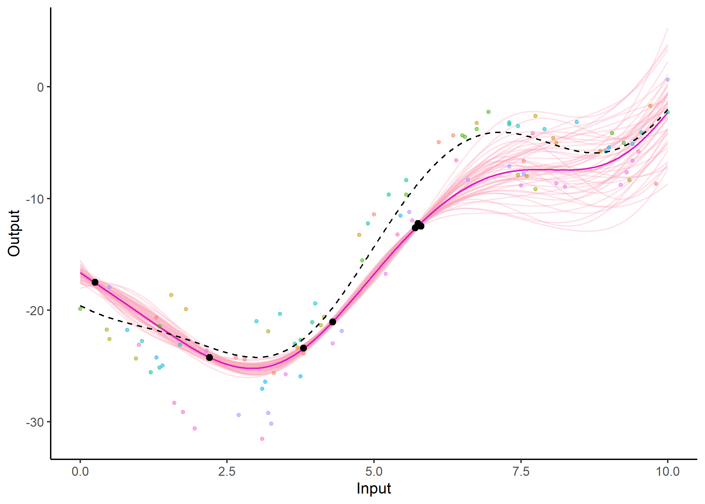
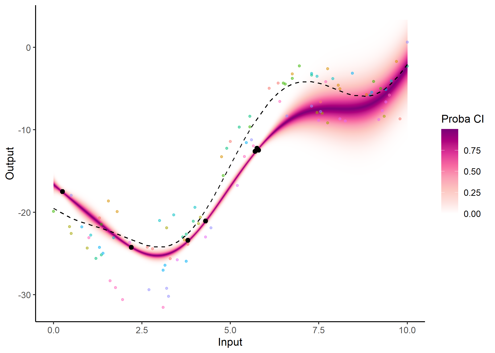

<!-- README.md is generated from README.Rmd. Please edit that file -->

# MagmaClustR 

<!-- badges: start -->

[](https://github.com/ArthurLeroy/MagmaClustR/actions)
[](https://app.codecov.io/gh/ArthurLeroy/MagmaClustR)
<!-- badges: end -->

The *MagmaClustR* package implements two main algorithms, called Magma
(*Leroy et al., 2022*) and MagmaClust (*Leroy et al., 2020*), using a
multi-task Gaussian processes (GP) model to perform predictions for
supervised learning problems. Applications involving functional data,
such as multiple time series, are particularly well-handled. Theses
approaches leverage the learning of cluster-specific mean processes,
which are common across similar tasks, to provide enhanced prediction
performances (even far from data points) at a linear computational cost
(in the number of tasks). MagmaClust is a generalisation of Magma where
the tasks are simultaneously clustered into groups, each being
associated to a specific mean process. User-oriented functions in the
package are decomposed into training, prediction and plotting functions.
Some basic features of standard GPs are also implemented.

Leroy, A., Latouche, P., Guedj, B., Gey, S. MAGMA: inference and
prediction using multi-task Gaussian processes with common mean. *Mach
Learn* **111**, 1821–1849 (2022).
<https://doi.org/10.1007/s10994-022-06172-1>

Leroy, A., Latouche, P., Guedj, B., & Gey, S. Cluster-Specific
Predictions with Multi-Task Gaussian Processes. *arXiv preprint* (2020).
<https://arxiv.org/abs/2011.07866>

## Installation

You can install the released version of MagmaClustR from
[CRAN](https://CRAN.R-project.org) with:

``` r
install.packages("MagmaClustR")
```

And the development version from [GitHub](https://github.com/) with:

``` r
# install.packages("devtools")
devtools::install_github("ArthurLeroy/MagmaClustR")
```

## Example: Magma

Here is a basic example on how to simulate a dataset with the adequate
format, then train a Magma model and use it to perform predictions.

### Data generation

``` r
library(MagmaClustR)
## Simulate a dataset with 11 individuals, each observed at 10 input locations
set.seed(17)
data_magma <- simu_db(M = 11, N = 10, common_input = FALSE)
## Split individuals into training and prediction sets, and define test points
magma_train <- data_magma %>% subset(ID %in% 1:10)
magma_pred <- data_magma %>% subset(ID == 11) %>% head(7)
magma_test <- data_magma %>% subset(ID == 11) %>% tail(3)

data_magma
#> # A tibble: 110 x 3
#>    ID    Input Output
#>    <chr> <dbl>  <dbl>
#>  1 1      1.3  -20.7 
#>  2 1      2.65 -24.2 
#>  3 1      2.8  -24.4 
#>  4 1      3.3  -25.6 
#>  5 1      3.8  -23.9 
#>  6 1      5    -11.4 
#>  7 1      6.1   -4.97
#>  8 1      6.35  -4.35
#>  9 1      7.55  -6.63
#> 10 1      9.8   -8.68
#> # ... with 100 more rows
```

As displayed above, any dataset processed in MagmaClustR should provide
columns named `ID`, `Input`, and `Output`. Any additional column would
be treated as a covariate (and thus define multi-dimensional inputs).

### Training and prediction with Magma

``` r
model <- train_magma(data = magma_train, common_hp = F)
#> The 'prior_mean' argument has not been specified. The hyper_prior mean function is thus set to be 0 everywhere.
#>  
#> The 'ini_hp_0' argument has not been specified. Random values of hyper-parameters for the mean process are used as initialisation.
#>  
#> The 'ini_hp_i' argument has not been specified. Random values of hyper-parameters for the individal processes are used as initialisation.
#>  
#> EM algorithm, step 1: 5.18 seconds 
#>  
#> Value of the likelihood: -313.47546 --- Convergence ratio = Inf
#>  
#> EM algorithm, step 2: 2.7 seconds 
#>  
#> Value of the likelihood: -303.47668 --- Convergence ratio = 0.03295
#>  
#> EM algorithm, step 3: 2.51 seconds 
#>  
#> Value of the likelihood: -302.84575 --- Convergence ratio = 0.00208
#>  
#> EM algorithm, step 4: 2.04 seconds 
#>  
#> Value of the likelihood: -302.56379 --- Convergence ratio = 0.00093
#>  
#> The EM algorithm successfully converged, training is completed. 
#> 

pred  <- pred_magma(data = magma_pred,
                    trained_model = model, 
                    grid_inputs = seq(0,10, 0.01))
#> The hyper-posterior distribution of the mean process provided in 'hyperpost' argument isn't evaluated on the expected inputs.
#>  
#>  Start evaluating the hyper-posterior on the correct inputs...
#>  
#> The 'prior_mean' argument has not been specified. The hyper-prior mean function is thus set to be 0 everywhere.
#>  
#> Done!
#>  
#> The 'hp' argument has not been specified. The 'train_gp()' function (with random initialisation) has been used to learn ML estimators for the hyper-parameters associated with the 'kern' argument.
#> 
```



Note that the `common_hp` and `grid_inputs` arguments are optional. They
respectively indicate that a specific set of hyper-parameters is trained
for each curve, and control the grid of values on which the prediction
is performed.

### Display the resulting predictions

Several other arguments are available in dedicated plotting functions to
offer extended options in the display of results. For instance, the GP
predictions can be represented as a heatmap of probabilities:

``` r
plot_gp(pred_gp = pred,
        data = magma_pred,
        data_train = magma_train,
        prior_mean = model$hyperpost$mean,
        heatmap = TRUE) 
```



Additionally, it is also possible to create animated representations by
using functions that generate GIFs. For instance, below, the true
testing points have been represented as red dots and we can observe how
the prediction evolves as we add more data points to our prediction
dataset.

``` r

pred_gif  <- pred_gif(data = magma_pred,
                      trained_model = model,
                      grid_inputs = seq(0, 10, 0.01))
#>  => 1 => 2 => 3 => 4 => 5 => 6 => 7

plot_gif(pred_gp = pred_gif,
         data = magma_pred,
         data_train = magma_train,
         prior_mean = model$hyperpost$mean) + 
  ggplot2::geom_point(data = magma_test,
                      ggplot2::aes(x = Input, y = Output),
                      color = 'red', size = 2)
```


## Example: MagmaClust

Here is a basic example on how to simulate a dataset with the adequate
format, then train a MagmaClust model and use it to perform simultaneous
clustering and predictions.

### Data generation

``` r
## Simulate a dataset containing 3 clusters of 4 individuals, each observed at 10 input locations
set.seed(4) 
data_magmaclust <- simu_db(M = 4, N = 10, K = 3, common_input = FALSE) 
## Split individuals into training and prediction sets, and define test points
list_ID = unique(data_magmaclust$ID)
magmaclust_train <- data_magmaclust %>% subset(ID %in% list_ID[1:11])
magmaclust_pred <- data_magmaclust %>% subset(ID == list_ID[12]) %>% head(5)
magmaclust_test <- data_magmaclust %>% subset(ID == list_ID[12]) %>% tail(5)

data_magmaclust
#> # A tibble: 120 x 3
#>    ID         Input Output
#>    <chr>      <dbl>  <dbl>
#>  1 ID1-Clust1  0.2   32.4 
#>  2 ID1-Clust1  0.7   28.8 
#>  3 ID1-Clust1  2.05   6.62
#>  4 ID1-Clust1  2.1    5.46
#>  5 ID1-Clust1  3.15  -5.44
#>  6 ID1-Clust1  5.3  -16.5 
#>  7 ID1-Clust1  6.4  -24.7 
#>  8 ID1-Clust1  7.35 -31.4 
#>  9 ID1-Clust1  7.5  -32.4 
#> 10 ID1-Clust1  8.95 -42.7 
#> # ... with 110 more rows
```

### Training and prediction with MagmaClust

``` r
model_clust <- train_magmaclust(data = magmaclust_train)
#> The number of cluster argument has not been specified. There will be 3 cluster by default. 
#>  
#> The 'ini_hp_i' argument has not been specified. Random values of hyper-parameters for the individual processes are used as initialisation.
#>  
#> The 'ini_hp_k' argument has not been specified. Random values of hyper-parameters for the mean processes are used as initialisation.
#>  
#> The 'prior_mean' argument has not been specified. The hyper_prior mean function is thus set to be 0 everywhere.
#>  
#> VEM algorithm, step 1: 20.02 seconds 
#>  
#> Value of the elbo: -712.16808 --- Convergence ratio = Inf
#>  
#> VEM algorithm, step 2: 12.18 seconds 
#>  
#> Value of the elbo: -635.70636 --- Convergence ratio = 0.12028
#>  
#> VEM algorithm, step 3: 14.54 seconds 
#>  
#> Value of the elbo: -623.0371 --- Convergence ratio = 0.02033
#>  
#> VEM algorithm, step 4: 10.76 seconds 
#>  
#> Value of the elbo: -619.56266 --- Convergence ratio = 0.00561
#>  
#> VEM algorithm, step 5: 8.23 seconds 
#>  
#> Value of the elbo: -618.50147 --- Convergence ratio = 0.00172
#>  
#> VEM algorithm, step 6: 10.46 seconds 
#>  
#> Value of the elbo: -617.95297 --- Convergence ratio = 0.00089
#>  
#> The EM algorithm successfully converged, training is completed. 
#> 

pred_clust  <- pred_magmaclust(data = magmaclust_pred,
                               trained_model = model_clust,
                               grid_inputs = seq(0, 10, 0.01), 
                               plot = FALSE)
#> The hyper-posterior distribution of the mean process provided in 'hyperpost' argument isn't evaluated on the expected inputs. Start evaluating the hyper-posterior on the correct inputs...
#>  
#> The 'prior_mean_k' argument has not been specified. The hyper-prior  mean functions are thus set to be 0 everywhere.
#>  
#> Done!
#> 
```

### Display the resulting predictions

As before, a specific plotting function is provided. For MagmaClust, we
advise to use the heatmap representation in priority, as a mixture of
GPs may not be unimodal in general (and thus prevents the definition of
Credible Interval).

``` r
## Allocate individuals to their most probable cluster to colour them by clusters afterwards
data_train_with_clust = data_allocate_cluster(model_clust)

plot_magmaclust(pred = pred_clust,
                cluster = "all",
                data = magmaclust_pred,
                data_train = data_train_with_clust,
                col_clust = TRUE,
                prior_mean = model_clust$hyperpost$mean,
                y_grid = seq(10, 55, 0.5),
                heatmap = TRUE) 
#> The mixture probability of the cluster K1 is 1. Therefore, the predictive distribution is Gaussian and the associated credible interval can be displayed.
```


## Example: in 2-dimensions

Although unidimensional-input problems are easier to visualise, both
Magma and MagmaClust can also be applied with as many covariates as
desired in the model.

### Data generation

``` r
## Dataset with 11 individuals, 10 reference input locations and a covariate
set.seed(5) 
data_dim2 <- simu_db(M = 11, N = 10, covariate = TRUE) 
## Split individuals into training and prediction sets, and define test points
dim2_train <- data_dim2 %>% subset(ID %in% 1:10)
dim2_pred <- data_dim2 %>% subset(ID == 11)

data_dim2
#> # A tibble: 110 x 4
#>    ID    Input Covariate Output
#>    <chr> <dbl>     <dbl>  <dbl>
#>  1 1      1.85       4.5  21.3 
#>  2 1      2.85       8.5   5.21
#>  3 1      2          4    24.8 
#>  4 1      3.25       7    12.3 
#>  5 1      3.5        2.5  37.0 
#>  6 1      5.3        5.5  20.0 
#>  7 1      6.5        5    20.8 
#>  8 1      6          2    34.1 
#>  9 1      7.3        9.5   5.18
#> 10 1      9.2        7.5   7.20
#> # ... with 100 more rows
```

### Training and prediction with Magma

``` r
model_dim2 <- train_magma(data = dim2_train)
#> The 'prior_mean' argument has not been specified. The hyper_prior mean function is thus set to be 0 everywhere.
#>  
#> The 'ini_hp_0' argument has not been specified. Random values of hyper-parameters for the mean process are used as initialisation.
#>  
#> The 'ini_hp_i' argument has not been specified. Random values of hyper-parameters for the individal processes are used as initialisation.
#>  
#> EM algorithm, step 1: 5.42 seconds 
#>  
#> Value of the likelihood: -247.66608 --- Convergence ratio = Inf
#>  
#> EM algorithm, step 2: 5.39 seconds 
#>  
#> Value of the likelihood: -217.29028 --- Convergence ratio = 0.13979
#>  
#> EM algorithm, step 3: 3.04 seconds 
#>  
#> Value of the likelihood: -216.11346 --- Convergence ratio = 0.00545
#>  
#> EM algorithm, step 4: 3.04 seconds 
#>  
#> Value of the likelihood: -216.02699 --- Convergence ratio = 4e-04
#>  
#> The EM algorithm successfully converged, training is completed. 
#> 

pred_dim2  <- pred_magma(data = dim2_pred,
                         trained_model = model_dim2)
#> The hyper-posterior distribution of the mean process provided in 'hyperpost' argument isn't evaluated on the expected inputs.
#>  
#>  Start evaluating the hyper-posterior on the correct inputs...
#>  
#> The 'prior_mean' argument has not been specified. The hyper-prior mean function is thus set to be 0 everywhere.
#>  
#> Done!
#> 
```


