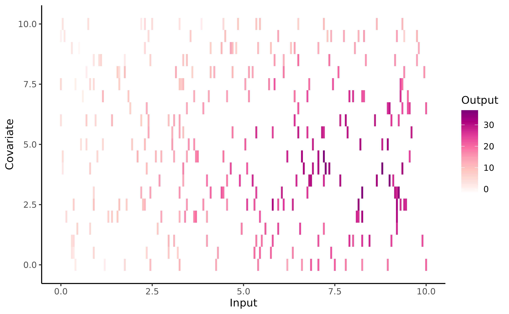
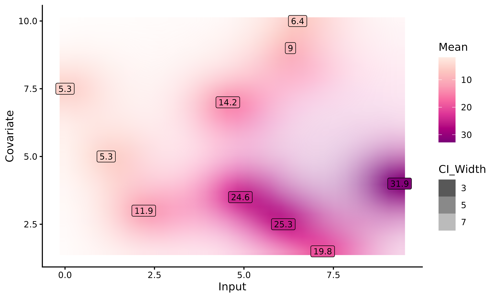
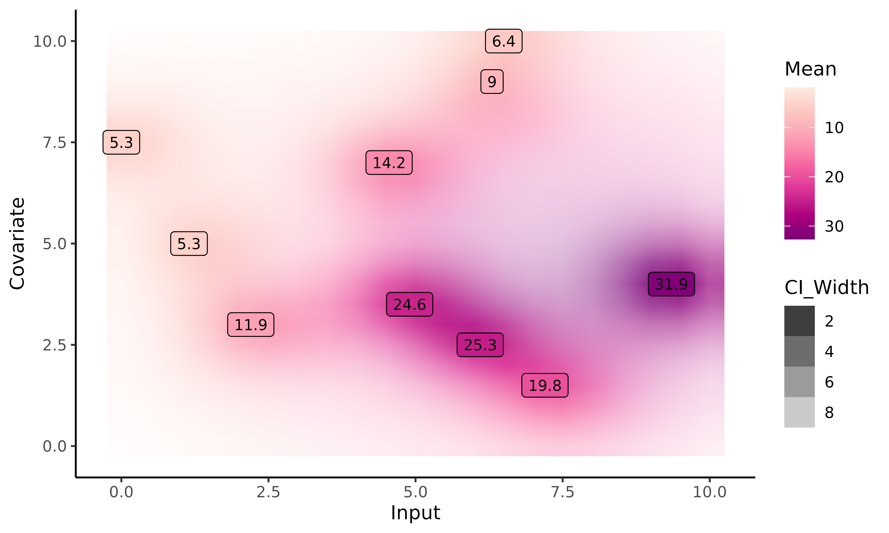

# Multi-dimensional inputs in Magma

``` r
library(MagmaClustR)
library(dplyr)
library(ggplot2)
```

## Purpose

In
[Magma](https://arthurleroy.github.io/MagmaClustR/articles/how-to-use-magmaclust.html)
and
[MagmaClust](https://arthurleroy.github.io/MagmaClustR/articles/how-to-use-magmaclust.html)
vignettes, it has been emphasised that, to be processed within
`MagmaClustR`, a dataset must contain at least 3 mandatory columns:
`ID`, `Input` and `Output`. However, let us point out that both *Magma*
and *MagmaClust* can also handle multi-dimensional inputs. Notice that
there are no constraints on the names of the additional input columns
(except for the name *Reference* that is used internally in the code and
should be **strictly** avoided).

Throughout the following synthetic example, the *Magma* algorithm is
applied to tackle a 2-dimensional forecasting problem. More
specifically, the model is trained on a dataset that contains 2 input
variables, namely `Input` and `Covariate`.

## Data generation

To explore the features of Magma in 2D, we simulate a synthetic dataset
thanks to the
[`simu_db()`](https://arthurleroy.github.io/MagmaClustR/reference/simu_db.md)
function. To customise this dataset, we can specify several parameters,
such as:

- the number **K** of underlying clusters in our dataset. Since we do
  not assume that there are group structures in our data, we set `K = 1`
  (default).

- the number **M** of individuals per cluster. Even if Magma
  performances improve with respect to the number of training
  individuals, 30 are more than enough to get an idea of how this 2D
  version works. Thus, we specify `M = 31`: 30 individuals for the
  training, 1 for the prediction.

- the number **N** of observations per individual. Here, we set `N = 10`
  data points.

- the presence / absence of an additional input named `Covariate`. As we
  want to handle multi-dimensional inputs, we specify
  `covariate = TRUE`.

- the fact that all individuals share common inputs (regular or
  irregular measurements among individuals). Here, we set
  `common_input = FALSE` to define a grid that covers various regions of
  the input space (`Input` and `Covariate`).

Many additional arguments are available, see
[`simu_db()`](https://arthurleroy.github.io/MagmaClustR/reference/simu_db.html)
for details.

``` r
set.seed(3)
data_dim2 <- simu_db(M = 31, 
                     N = 10, 
                     K = 1, 
                     covariate = TRUE,
                     common_input = FALSE)

knitr::kable(head(data_dim2))
```

| ID  | Input | Covariate |    Output |
|:----|------:|----------:|----------:|
| 1   |  0.95 |       6.0 |  5.145306 |
| 1   |  1.80 |       2.5 |  7.277505 |
| 1   |  2.35 |       4.0 | 10.054762 |
| 1   |  3.65 |       2.0 | 17.831701 |
| 1   |  5.15 |       7.0 | 18.321026 |
| 1   |  5.30 |       0.5 | 17.015734 |

To provide a visual intuition of the values contained in training set,
we can display raw data (using the signature gradient colour of
`MagmaClustR` ;) ) with the following code:

``` r
ggplot(data_dim2) +
  geom_tile(aes(x = Input, y = Covariate, fill = Output)) +
  theme_classic() +
  scale_fill_gradientn(colours = c(
    "white",
    "#FDE0DD",
    "#FCC5C0",
    "#FA9FB5",
    "#F768A1",
    "#DD3497",
    "#AE017E",
    "#7A0177"))
```



Let us mention that any dataset in `MagmaClustR` can be regularised if
necessary (in the sense that we can modify the input grid to match a
specific format). To this end, the
[`regularize_data()`](https://arthurleroy.github.io/MagmaClustR/reference/regularize_data.md)
function is proposed, allowing us to constrain the number of data points
per input, or specify ‘by hand’ a surrogate grid of inputs on which to
project our data. This function takes the arguments:

- `data`,corresponding to database we want to regularise;
- `size_grid`, indicating how many points each axis of the grid must
  contain;
- `grid_inputs`, the grid on which we want to project our data. If NULL
  (default), a dedicated grid of inputs is defined: for each input
  column, a regular sequence is created from the min input values to the
  max, with a number of equispaced points equal to the ‘size_grid’
  argument. We could also project our data on a specific `grid_inputs`
  (which may come from the dedicated
  [`expand_grid_inputs()`](https://arthurleroy.github.io/MagmaClustR/reference/expand_grid_inputs.md)
  function; see **Customise graphs** for details). This grid does not
  necessarily have the same number of points along all axes.
- `summarise_fct`, a function used to summarise data points if several
  similar inputs are associated with different outputs.

For instance, if we would want to evaluate our synthetic dataset on a
$5 \times 5$ grid of inputs summarise the projected outputs according
through their mean, we could call:

``` r
data_dim2_reg <- regularize_data(data = data_dim2,
                             size_grid = 5,
                             grid_inputs = NULL,
                             summarise_fct = "mean")

knitr::kable(head(data_dim2_reg))
```

| ID  | Input | Covariate |    Output |
|:----|------:|----------:|----------:|
| 1   |   0.0 |       5.0 |  5.145306 |
| 1   |   2.5 |       2.5 | 12.554603 |
| 1   |   2.5 |       5.0 | 10.054762 |
| 1   |   5.0 |       0.0 | 17.015734 |
| 1   |   5.0 |       7.5 | 18.321026 |
| 1   |   7.5 |       5.0 | 25.512476 |

Finally, we split our individuals into training and prediction sets.

``` r
dim2_train <- data_dim2 %>% filter(ID %in% 1:30)
dim2_pred <- data_dim2 %>% filter(ID == 31) 
```

## Training and prediction in 2-D

The overall process of *Magma* remains identical as in the 1-D case, and
can be decomposed in 3 main steps: **training, prediction** and
**plotting of results**. We refer to the [Magma
vignette](https://arthurleroy.github.io/MagmaClustR/articles/how-to-use-magmaclust.html)
for the complete description of the classical pipeline: - we call the
[`train_magma()`](https://arthurleroy.github.io/MagmaClustR/reference/train_magma.html)
function to train our model:

``` r
set.seed(3)
model_dim2 <- train_magma(data = dim2_train, 
                          kern_0 = "SE",
                          kern_i = "SE",
                          common_hp = TRUE)
#> The 'prior_mean' argument has not been specified. The hyper_prior mean function is thus set to be 0 everywhere.
#>  
#> The 'ini_hp_0' argument has not been specified. Random values of hyper-parameters for the mean process are used as initialisation.
#>  
#> The 'ini_hp_i' argument has not been specified. Random values of hyper-parameters for the individal processes are used as initialisation.
#>  
#> EM algorithm, step 1: 3.59 seconds 
#>  
#> Value of the likelihood: -1113.46118 --- Convergence ratio = Inf
#>  
#> EM algorithm, step 2: 2.78 seconds 
#>  
#> Value of the likelihood: -1079.22628 --- Convergence ratio = 0.03172
#>  
#> EM algorithm, step 3: 2.84 seconds 
#>  
#> Value of the likelihood: -1078.65383 --- Convergence ratio = 0.00053
#>  
#> The EM algorithm successfully converged, training is completed. 
#> 
```

- we perform prediction for a new individual thanks to
  [`pred_magma()`](https://arthurleroy.github.io/MagmaClustR/reference/pred_magma.html).
  Here, we do not specify the `grid_inputs` argument; in this case, a
  default grid is automatically generated by
  [`pred_magma()`](https://arthurleroy.github.io/MagmaClustR/reference/pred_magma.md),
  ranging between the *min* and *max* `Input` and `Covariate` values of
  our dataset. However, if we want to perform prediction on a specific
  2-D area, we could provide a specific `grid_inputs`; see **Even
  prettier graphics** section for details.

``` r
pred_dim2  <- pred_magma(data = dim2_pred,
                         trained_model = model_dim2,
                         plot = FALSE)
#> The hyper-posterior distribution of the mean process provided in 'hyperpost' argument isn't evaluated on the expected inputs.
#>  
#>  Start evaluating the hyper-posterior on the correct inputs...
#>  
#> The 'prior_mean' argument has not been specified. The hyper-prior mean function is thus set to be 0 everywhere.
#>  
#> Done!
#> 
```

- we display the results with
  [`plot_gp()`](https://arthurleroy.github.io/MagmaClustR/reference/plot_gp.html).
  As this step constitutes the main evolution of the one-dimensional
  version, we devote an entire section to discuss it below.

## Display of results

With the
[`plot_gp()`](https://arthurleroy.github.io/MagmaClustR/reference/plot_gp.html)
function, we can display the predicted posterior mean values of
`ID = 31`. The prediction is represented as a 2-D heatmap of
probabilities where:

- the x-axis corresponds to the `Input` column of our dataset; the
  y-axis, to the `Covariate` column;
- each (x,y) couple of inputs is associated with a colour (from a colour
  gradient range) corresponding to the posterior mean value at this
  input. The darker the posterior mean, the higher the value;
- the uncertainty is represented on the graph by the
  transparency/opacity associated with the previous colour. The narrower
  the 95% Credible Interval, the more opaque the associated colour.

Unfortunately, 2-D inputs inevitably lead to constraints when it comes
to visualisation, preventing us to provide as much information as for
1-D. In particular, the graph below does not display the mean process
nor the training data, as we were not able to find appropriate
representations (that would also not surcharge the graph).

``` r
plot_gp(pred_gp = pred_dim2,
        data = dim2_pred) 
```



### Customise graphs

#### With a specific grid of inputs

As with the unidimensional version, we can create our own grid of inputs
if we want to perform prediction on a specific 2D area (potentially
wider than the dataset one). Contrary to the unidimensional version, the
`grid_inputs` can no longer be a simple sequence of numbers for which
the prediction must be performed, but a 2D grid containing :

- on the x-axis, a sequence of `Input` for which we want to perform
  prediction ;
- on the y-axis, a sequence of `Covariate` for which we want to perform
  prediction.

To create our grid, we use the
[`expand_grid_inputs()`](https://arthurleroy.github.io/MagmaClustR/reference/expand_grid_inputs.md)
function. We only have to specify a sequence of `Input` and as many
covariates as we want. However, we must also ensure that we do not
generate too much data points ; we recall that Magma has a cubic
complexity, so the execution can be extremely long depending on the
number and length of sequences. Therefore, we advise to reduce the
length of the Inputs sequences if we want to perform a high dimensional
prediction. Moreover, each Input must have the same name as in the data
base to avoid errors during the prediction step.

``` r
grid_inputs_dim2 <- expand_grid_inputs(Input = seq(0,10,0.5), Covariate = seq(0,10,0.5))

pred_dim2  <- pred_magma(data = dim2_pred,
                         trained_model = model_dim2,
                         grid_inputs = grid_inputs_dim2,
                         plot = TRUE)
#> The hyper-posterior distribution of the mean process provided in 'hyperpost' argument isn't evaluated on the expected inputs.
#>  
#>  Start evaluating the hyper-posterior on the correct inputs...
#>  
#> The 'prior_mean' argument has not been specified. The hyper-prior mean function is thus set to be 0 everywhere.
#>  
#> Done!
#> 
```



Here, we perform prediction on a `grid_inputs` wider than the one
generated automatically by
[`pred_magma()`](https://arthurleroy.github.io/MagmaClustR/reference/pred_magma.md).
For `Input` values higher than the dataset ones, no observations are
available, neither from `ID = 31` nor from the training dataset. Magma
behaves as expected, with a slow drifting to the prior mean (here, zero)
and an highly increasing variance.

#### Create a 2D GIF

As with 1-D Magma, it is possible to create animated representations
thanks to
[`pred_gif()`](https://arthurleroy.github.io/MagmaClustR/reference/pred_gif.html)
and
[`plot_gif()`](https://arthurleroy.github.io/MagmaClustR/reference/plot_gif.html).

These functions offer dynamic plots by generating GIFs thanks to
`gganimate` package. Then, we can observe how the prediction evolves as
we add more data points to our prediction dataset.

[`pred_gif()`](https://arthurleroy.github.io/MagmaClustR/reference/pred_gif.md)
and
[`plot_gif()`](https://arthurleroy.github.io/MagmaClustR/reference/plot_gif.md)
functions work the same as
[`pred_magma()`](https://arthurleroy.github.io/MagmaClustR/reference/pred_magma.md)
and
[`plot_gp()`](https://arthurleroy.github.io/MagmaClustR/reference/plot_gp.md)
in the 2D version. Some extra arguments can be customized in
[`plot_gif()`](https://arthurleroy.github.io/MagmaClustR/reference/plot_gif.md),
like adjusting the GIF speed, saving the plotted GIF, etc…

##### Magma 2-D vs GP 2-D

The MagmaClustR package also provides a prediction with classic GPs in
2D; thus, we can compare Magma and classic GPs predictions.

The graphs below correspond to the 2D dynamic prediction with Magma
(first one) and classic GP (second one).

This example highlights the advantage of sharing information across
individuals: even before seeing any data, Magma provides an already
accurate mean process. As we add more data for the individual of
interest, the uncertainty of predictions slightly decreases, although
the main trend remains mainly similar.

On the other hand, the classic GP struggles to find the shape of the
underlying process. On unobserved regions of the graph, the prediction
remains far from the original process. As expected, though, the more
data we add, the better becomes the prediction with standard GP.
