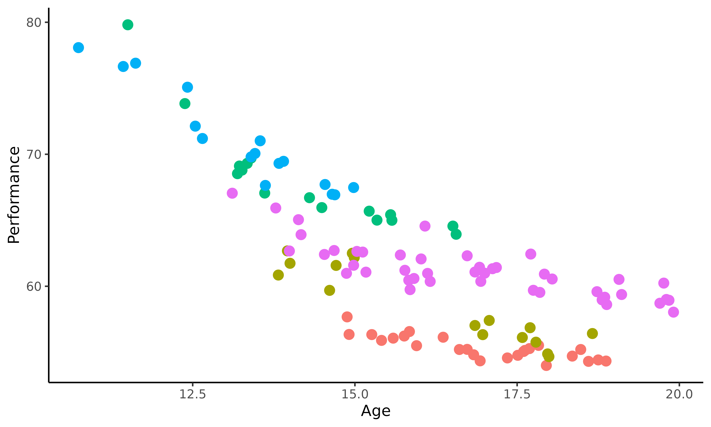
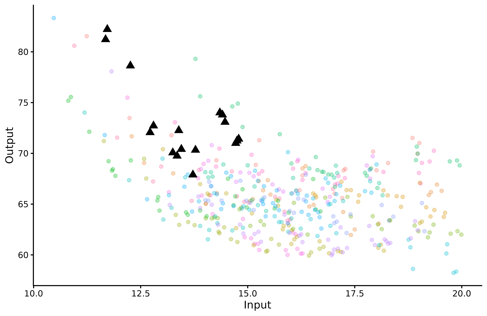
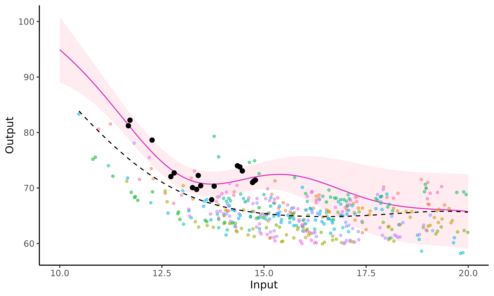
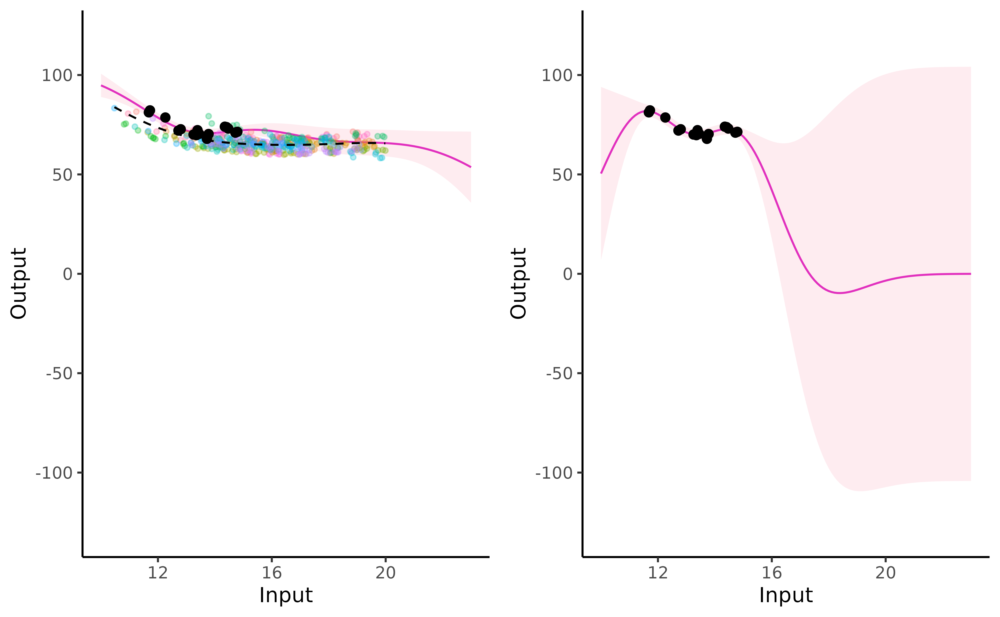
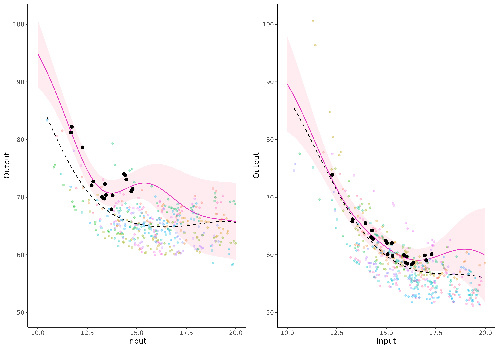
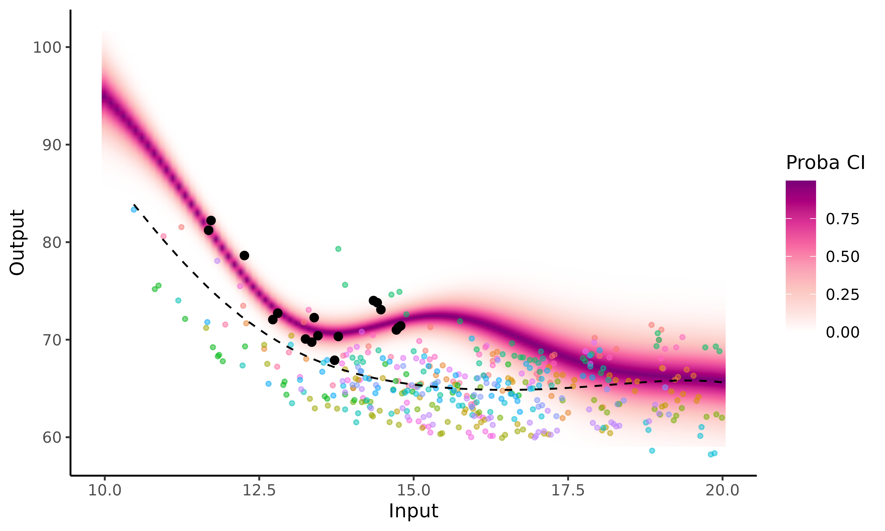
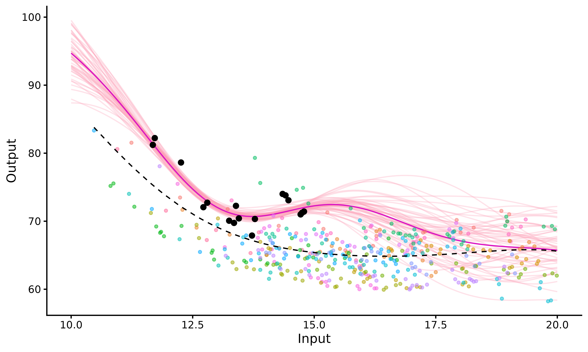
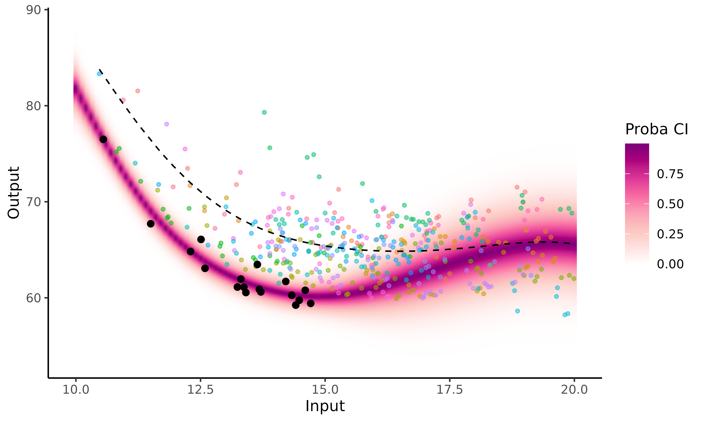

# How to use Magma

``` r
library(MagmaClustR)
library(dplyr)
library(ggplot2)
if(rlang::is_installed("gridExtra")){library(gridExtra)}
```

## Context

To explore the different features of *Magma*, we use the `swimmers`
dataset provided by the French Swimming Federation (available
[here](https://github.com/ArthurLeroy/MAGMAclust/blob/master/Real_Data_Study/Data/db_100m_freestyle.csv),
and studied more thoroughly
[here](https://link.springer.com/article/10.1007/s10994-022-06172-1) and
[there](https://arxiv.org/abs/2011.07866)).

This dataset gathers competition results in 100m freestyle events
between 2002 and 2016 for 1725 men and 1731 women, and a total of 38481
and 38351 performances, respectively.

Throughout this `swimmers` example, we use Magma as a decision support
tool to detect promising young athletes, which is a classical problem in
an elite sport context. More specifically, Magma is used to model
swimmers progression curves and forecast their future performances.
Indeed, a multi-task GPs model offers new perspectives like
probabilistic predictions, which provides insights to sport structures
for their future decisions.

More generally, our task is to train a model with a large dataset and
predict a new individual thanks to shared information.

To get a better idea of the `swimmers` dataset content, we display the
performances of 5 swimmers according to their age. Do all the swimmers
progress the same, *i.e.* with the same pattern? Do the most successful
young swimmers remain the best when they get older? Those are the kind
of questions we aim to tackle in the following.

``` r
ggplot2::ggplot(data=swimmers %>% filter(ID %in% 1:5),
       mapping = ggplot2::aes(x=Age,y=Performance,colour=factor(ID)))+
  ggplot2::geom_point(size=3) +
  ggplot2::theme_classic() +
  ggplot2::guides(colour="none")
```



This plot highlights the sparsity and irregularity of our functional
data; swimmers performances are observed irregularly, with some areas
containing very few observations (particularly for the younger ages).
Moreover, it clearly appears that there are different swimmer profiles,
especially due to different evolutions of morphology during teen years.
Therefore, it might be important to take them into account if one wants
to improve the quality of talent detection strategies.

### Dataset format

The `swimmers` dataset contains 4 columns: `ID`, `Age`, `Performance`
and `Gender`. Each row represents a performance realised by a swimmer at
a given age. More specifically, each column contains:

- `ID`, the identifying number associated with each swimmer;
- `Age`, the age of the swimmer at the moment of the performance;
- `Performance`, the chronometric performance on a 100m freestyle (in
  seconds);
- `Gender`, a number indicating the competitive gender of the swimmer (1
  corresponds to men and 2 to women).

``` r
knitr::kable(swimmers[1:5,])
```

| ID  |   Age | Performance | Gender |
|:----|------:|------------:|-------:|
| 1   | 14.88 |       57.68 |      1 |
| 1   | 14.91 |       56.35 |      1 |
| 1   | 15.26 |       56.34 |      1 |
| 1   | 15.41 |       55.90 |      1 |
| 1   | 15.59 |       56.07 |      1 |

If new variables (such as weight, height, number of training hours …)
would have been observed, any additional column would be treated as a
covariate, and thus result in a model with multi-dimensional inputs.

Before starting to use *Magma*, we must ensure that our dataset contains
at least the three following mandatory columns with adequate type: -
`ID`: `character` or `factor`; - `Input`: `numeric`; - `Output`:
`numeric`.

## Classical pipeline

The overall process of the *Magma* algorithm can be decomposed in 3 main
steps: **training, prediction** and **plotting the results**. The
corresponding functions are:

- [`train_magma()`](https://arthurleroy.github.io/MagmaClustR/reference/train_magma.html)
- [`pred_magma()`](https://arthurleroy.github.io/MagmaClustR/reference/pred_magma.html)
- [`plot_magma()`](https://arthurleroy.github.io/MagmaClustR/reference/plot_magma.html)

## Applying Magma on the swimmer dataset

### Data organisation

For the sake of consistency, we split male and female swimmers into
different datasets: `swimmers_m` and `swimmers_f`. The following study
is dedicated to women performances and thus focus on the `swimmers_f`
dataset.

In addition, we need to change the name of the input and output columns
as indicated before, and remove the `Gender` one.

``` r
swimmers_m <- swimmers %>% filter(Gender == 1) %>%
  select(-Gender) %>% 
  rename(Input = Age, Output = Performance)

swimmers_f <- swimmers %>% filter(Gender == 2) %>%
  select(-Gender) %>%
  rename(Input = Age, Output = Performance)
```

To continue this data management procedure, the swimmers are allocated
into two groups:

- those we use to train the model;
- the one for whom we predict future performances; let’s give her the
  fictive name *Michaela*.

To limit computation time in this illustrative example, we randomly
select 20 swimmers for training. Even if the performances of *Magma*
increase with the number of training individuals, 20 are more than
enough to get a clear idea of how the algorithm works.

``` r
set.seed(3)
list_ID <- swimmers_f %>% pull(ID) %>% sample()
swimmers_train <- swimmers_f %>% filter(ID %in% list_ID[1:20])
swimmers_pred <- swimmers_f %>% filter(ID == 1718)
```

``` r
ggplot2::ggplot(data=swimmers_train,
       mapping = ggplot2::aes(x=Input,y=Output,colour=factor(ID)))+
  ggplot2::geom_point(size=1.5,alpha=0.3)+
  ggplot2::geom_point(data = swimmers_pred,
             size=3,
             shape=17,
             color="black") +
  ggplot2::theme_classic() +
  ggplot2::guides(colour="none")
```



The triangles correspond to Michaela’s performances, whereas the
coloured dots represent the swimmers data we use for training.

### Training

It’s now time to train the model thanks to
[`train_magma()`](https://arthurleroy.github.io/MagmaClustR/reference/train_magma.md),
for which several arguments can be specified:

- `prior_mean`: if we assume no *prior* knowledge about the 100m
  freestyle, we can decide to leave the default value for this parameter
  (*i.e.* zero). However, if we want to take expert advice into account,
  we can modify the value of `prior_mean` accordingly.

- `kern`: the relationship between observed data and prediction targets
  can be control through the covariance **kernel**. Therefore, in order
  to correctly fit our data, we need to choose a suitable covariance
  kernel. In the case of swimmers, we want a smooth progression curve
  for Michaela; therefore, we specify `kern = "SE"`.

The most commonly used kernels and their properties are discussed in
[the kernel cookbook](https://www.cs.toronto.edu/~duvenaud/cookbook/).
Details of available kernels and how to combine them in the package are
available in
[`help(train_magma)`](https://arthurleroy.github.io/MagmaClustR/reference/train_magma.html).

- `common_hp`: here, we assume that the set of hyper-parameters is
  common to all individuals. Thus, we model a context where individuals
  represent different trajectories of the same process, whereas
  different hyper-parameters indicate different covariance structures
  and thus a more flexible model.

As for any GP method, initialisation of the hyper-parameters may have an
influence on the final optimisation and lead to inadequate prediction
for pathological cases. Therefore, users may explicitly define specific
initial values through the dedicated `ini_hp` argument.

Other parameters can also be specified; see
[`help(train_magma)`](https://arthurleroy.github.io/MagmaClustR/reference/train_magma.html)
for details.

``` r
set.seed(3)
model <- train_magma(data = swimmers_train,
                     kern_0 = "SE",
                     kern_i = "SE",
                     common_hp = TRUE)
#> The 'prior_mean' argument has not been specified. The hyper_prior mean function is thus set to be 0 everywhere.
#>  
#> The 'ini_hp_0' argument has not been specified. Random values of hyper-parameters for the mean process are used as initialisation.
#>  
#> The 'ini_hp_i' argument has not been specified. Random values of hyper-parameters for the individal processes are used as initialisation.
#>  
#> EM algorithm, step 1: 7.33 seconds 
#>  
#> Value of the likelihood: -1306.74731 --- Convergence ratio = Inf
#>  
#> EM algorithm, step 2: 4.45 seconds 
#>  
#> Value of the likelihood: -1240.53711 --- Convergence ratio = 0.05337
#>  
#> EM algorithm, step 3: 2.6 seconds 
#>  
#> Value of the likelihood: -1228.4203 --- Convergence ratio = 0.00986
#>  
#> EM algorithm, step 4: 3.59 seconds 
#>  
#> Value of the likelihood: -1225.61283 --- Convergence ratio = 0.00229
#> 
#> Warning in train_magma(data = swimmers_train, kern_0 = "SE", kern_i = "SE", :
#> The likelihood descreased. Possible numerical issues.
#> EM algorithm, step 5: 3.62 seconds 
#>  
#> Value of the likelihood: -1225.6443 --- Convergence ratio = -3e-05
#>  
#> The EM algorithm successfully converged, training is completed. 
#> 
```

### Prediction for Michaela

As the *Magma* model is trained, we can now predict to predict the
evolution of Michaela’s performances. To perform prediction, we need to
specify two main parameters in the
[`pred_magma()`](https://arthurleroy.github.io/MagmaClustR/reference/pred_magma.md)
function:

- `data`: in our case, the sub-dataset containing Michaela’s current
  performances;
- `trained_model`, which corresponds to the model we just trained with
  the other 20 swimmers.

Let us mention that improvements in swimming are more prominent during
young ages, thus we here aim to predict the evolution of Michaela’s
performances between 10 and 20 years. Therefore, the argument
`grid_inputs = seq(10,20,0.1)` can be set to compute such a forecast of
interest.

``` r
pred <- pred_magma(data = swimmers_pred,
  trained_model = model,
  grid_inputs = seq(10,20,0.1),
  plot = FALSE)
#> The hyper-posterior distribution of the mean process provided in 'hyperpost' argument isn't evaluated on the expected inputs.
#>  
#>  Start evaluating the hyper-posterior on the correct inputs...
#>  
#> The 'prior_mean' argument has not been specified. The hyper-prior mean function is thus set to be 0 everywhere.
#>  
#> Done!
#> 
```

### Plots

The
[`plot_magma()`](https://arthurleroy.github.io/MagmaClustR/reference/plot_magma.html)
function can be used to depict the evolution of Michaela’s predicted
performances.

``` r
plot_magma(pred_gp = pred,
           data = swimmers_pred,
           prior_mean = model$hyperpost$mean,
           data_train = swimmers_train) 
```

 In the
above figure, we can observe:

- the prediction curve (purple line) and its associated 95% credibility
  interval (pink band);

- the training data points in the background (displayed through
  `data_train`). Each colour corresponds to one swimmer;

- the trained mean process as a dashed black line coming from the
  `prior_mean` parameter.

#### Magma VS classic GP

The *MagmaClustR* package also provides an implementation of the
standard GP regression, which we can compare to *Magma* in this example.
For more details on how to fit a single GP, see [Vignette
GPs](https://arthurleroy.github.io/MagmaClustR/articles/Lien).

The graphs below correspond to predictions of Michaela’s performances
between 10 and 23 years, according to *Magma* (left) and standard GP
(right).



On this visual comparison, 3 distinct phases can be highlighted:

- **first phase**: close to Michaela’s observed data
  ($t \in \lbrack 11,14\rbrack$), the two processes behave similarly. We
  note a slight increase in the variance for Magma, which is logical
  since the prediction also takes uncertainty over the **mean GP** into
  account;

- **second phase**: on intervals of unobserved timestamps containing
  data points from the training dataset ($t \in \lbrack 14,20\rbrack$),
  Magma prediction is guided by the information coming from other
  individuals through the **mean GP**. Thus, the mean trajectory remains
  coherent and the uncertainty increases only slightly. On the contrary,
  the simple GP quickly drifts to the prior zero mean as soon as data
  lack, and uncertainty increases significantly.

- **third phase**: where no observations are available, neither from the
  new individual nor the training dataset ($t > 20$), Magma behaves as
  expected, with a slow drift to the prior mean, with highly increasing
  variance.

Therefore, the main improvement in prediction brought by Magma lies in
the **second phase** thanks to information shared across individuals.

Overall, the multi-task framework provides reliable probabilistic
predictions for a new swimmer on a wider range of timestamps,
potentially outside of the usual scope of GPs. Furthermore, the
uncertainty provided through the predictive posterior distribution
offers an adequate degree of caution in a decision-making process.

#### Comparison of individuals

To compare the evolution on both genders, we display below the
progression curves predicted by *Magma* for a fictive male swimmer,
called Michael (right) and randomly selected within `swimmers_m`, along
with the one for Michaela (left).

``` r

## Draw a random subset for training and an individual for prediction
set.seed(9)
list_ID_m <- swimmers_m %>% pull(ID) %>% unique() %>% sample()
swimmers_train_m <- swimmers_m %>% filter(ID %in% list_ID_m[1:20])
swimmers_pred_m <- swimmers_m %>% filter(ID %in% list_ID_m[24])

## Train Magma on the male swimmers sub-dataset
model_m <- train_magma(data = swimmers_train_m,
                        kern_0 = "SE",
                        kern_i = "SE",
                        common_hp = TRUE)
#> The 'prior_mean' argument has not been specified. The hyper_prior mean function is thus set to be 0 everywhere.
#>  
#> The 'ini_hp_0' argument has not been specified. Random values of hyper-parameters for the mean process are used as initialisation.
#>  
#> The 'ini_hp_i' argument has not been specified. Random values of hyper-parameters for the individal processes are used as initialisation.
#>  
#> EM algorithm, step 1: 8.61 seconds 
#>  
#> Value of the likelihood: -1429.93441 --- Convergence ratio = Inf
#>  
#> EM algorithm, step 2: 2.83 seconds 
#>  
#> Value of the likelihood: -1411.28576 --- Convergence ratio = 0.01321
#>  
#> EM algorithm, step 3: 4.04 seconds 
#>  
#> Value of the likelihood: -1409.42677 --- Convergence ratio = 0.00132
#>  
#> EM algorithm, step 4: 4.16 seconds 
#>  
#> Value of the likelihood: -1409.17453 --- Convergence ratio = 0.00018
#>  
#> The EM algorithm successfully converged, training is completed. 
#> 

## Compute a prediction for Michael 
pred_m <- pred_magma(data = swimmers_pred_m,
  trained_model = model_m,
  grid_inputs = seq(10,20,0.1),
  plot = FALSE)
#> The hyper-posterior distribution of the mean process provided in 'hyperpost' argument isn't evaluated on the expected inputs.
#>  
#>  Start evaluating the hyper-posterior on the correct inputs...
#>  
#> The 'prior_mean' argument has not been specified. The hyper-prior mean function is thus set to be 0 everywhere.
#>  
#> Done!
#> 
```



We can note that both genders present similar patterns of progression: a
quick improvement of performances at young ages, then a slowdown in
progress that can even leads to a stagnation afterwards.

However, while performances are roughly similar in mean trend before the
age of 14, they start to differentiate afterwards and then converge to
average times with approximately a 5sec gap. Interestingly, the
difference between men and women world records in swimming 100m
freestyle competitions is currently 4.8sec (46.91 versus 51.71), which
is consistent with the difference between convergence times of the two
mean processes.

## Customise graphs

### With plot_magma()

In case of 1-dimensional inputs, we can depict Michaela’s prediction
graphs thanks to the
[`plot_magma()`](https://arthurleroy.github.io/MagmaClustR/reference/plot_gp.md)
function. Indeed, if by setting the argument `heatmap = TRUE`, we can
display a heatmap of probabilities instead using a 95% credibility
interval. Doing so, we get a thorough visual quantification for both the
dispersion of the predicted values and the confidence we may grant to
each of them.

``` r
plot_magma(pred_gp = pred_f,
        data = swimmers_pred,
        data_train = swimmers_train,
        prior_mean = model$hyperpost$mean,
        heatmap = TRUE)
```



Another convenient visualisation of uncertainty exists in the package by
displaying **samples** drawn from the predictive posterior distribution.
To draw those samples, you first need to keep the full posterior
covariance matrix by specifying the argument `get_full_cov = TRUE` when
calling
[`pred_magma()`](https://arthurleroy.github.io/MagmaClustR/reference/pred_magma.md).

``` r
pred_with_cov <- pred_magma(data = swimmers_pred,
                            trained_model = model,
                            get_full_cov = TRUE,
                            grid_inputs = seq(10,20,0.1),
                            plot = FALSE)
#> The hyper-posterior distribution of the mean process provided in 'hyperpost' argument isn't evaluated on the expected inputs.
#>  
#>  Start evaluating the hyper-posterior on the correct inputs...
#>  
#> The 'prior_mean' argument has not been specified. The hyper-prior mean function is thus set to be 0 everywhere.
#>  
#> Done!
#> 
```

Then, by leveraging the `samples = TRUE` argument of
[`plot_magma()`](https://arthurleroy.github.io/MagmaClustR/reference/plot_gp.md),
we can now draw and display sample curves, representing a set of
probable functions considering the observed data that we provided.

``` r
plot_magma(pred_gp = pred_with_cov,
           data = swimmers_pred,
           data_train = swimmers_train,
           prior_mean = model$hyperpost$mean,
           samples = TRUE)
```



### Create a GIF

If we want to create animated representations, please use the
[`pred_gif()`](https://arthurleroy.github.io/MagmaClustR/reference/pred_gif.html)
and
[`plot_gif()`](https://arthurleroy.github.io/MagmaClustR/reference/plot_gif.html)
functions, instead of
[`pred_magma()`](https://arthurleroy.github.io/MagmaClustR/reference/pred_magma.md)
and
[`plot_magma()`](https://arthurleroy.github.io/MagmaClustR/reference/plot_gp.md).
These functions offer dynamic plots by generating GIFs thanks to the
`gganimate` package. Such graphs exhibit how the GP prediction evolves
as we observe more data points.

[`pred_gif()`](https://arthurleroy.github.io/MagmaClustR/reference/pred_gif.md)
and
[`plot_gif()`](https://arthurleroy.github.io/MagmaClustR/reference/plot_gif.md)
functions work the same as
[`pred_magma()`](https://arthurleroy.github.io/MagmaClustR/reference/pred_magma.md)
and
[`plot_magma()`](https://arthurleroy.github.io/MagmaClustR/reference/plot_gp.md)
(except that no `plot` argument is required in
[`pred_gif()`](https://arthurleroy.github.io/MagmaClustR/reference/pred_gif.md)).
Some extra arguments can be customized in
[`plot_gif()`](https://arthurleroy.github.io/MagmaClustR/reference/plot_gif.md),
like adjusting the GIF speed, saving the plotted GIF (see `?gganimate`
for details)

``` r
pred_gif  <- pred_gif(data = swimmers_pred,
                      trained_model = model,
                      grid_inputs = seq(10,20,0.1))
#>  => 1 => 2 => 3 => 4 => 5 => 6 => 7 => 8 => 9 => 10 => 11 => 12 => 13 => 14 => 15 => 16 => 17
```

``` r
plot_gif(pred_gp = pred_gif,
         data = swimmers_pred,
         data_train = swimmers_train,
         prior_mean = model$hyperpost$mean,
         alpha_data_train = 0.3)
```

## Reference

This example highlights the interest of using a multi-task GP to predict
swimmers performances. However, the results are not restricted to this
illustrative study. For further details, the complete derivation of the
algorithm and experiments are published and available in [MAGMA:
inference and prediction using multi-task Gaussian processes with common
mean](https://link.springer.com/content/pdf/10.1007/s10994-022-06172-1.pdf).

## To go further: from Magma to MagmaClust

To underline the main limitation of Magma, we now propose to predict the
performances of an elite female swimmer in the dataset (under 60sec)
instead of Michaela’s.



Due to the high level of this swimmer, all of her performances are far
below the mean GP. Thus, when we try to predict her future evolution, we
may actually underestimate her potential; indeed, her progression curve
increases significantly once she has no data left, until it reaches the
mean process. Although, this behaviour is expected since the prediction
is guided by the information coming from other individuals (through the
mean process) who are less successful than her, the method could benefit
from accounting for differences between individual in the training
dataset.

This is why enabling cluster-specific mean processes to take into
account different swimmers profiles would be a relevant extension. This
enhancement of *Magma* corresponds to the *MagmaClust* algorithm; see
the corresponding
[vignette](https://arthurleroy.github.io/MagmaClustR/articles/how-to-use-magmaclust.html)
for further information.
