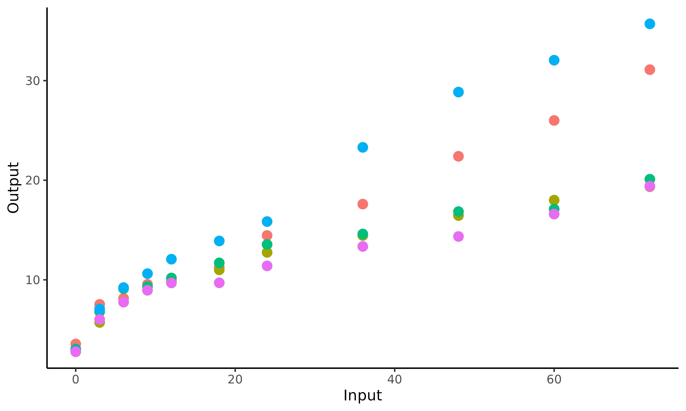
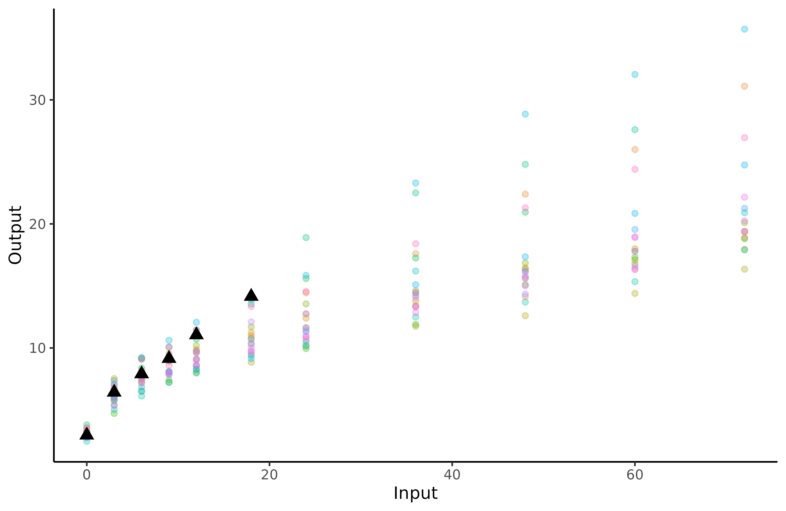
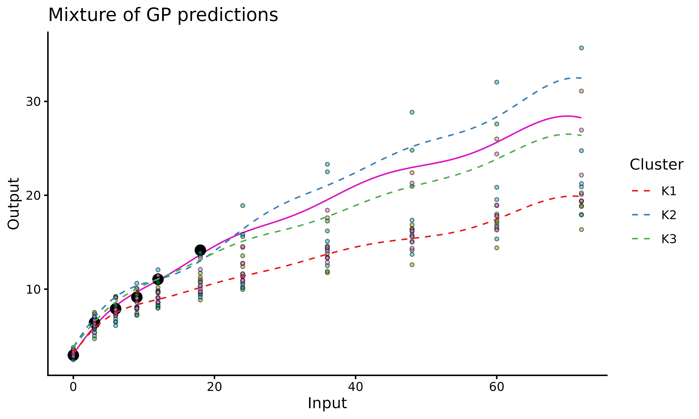
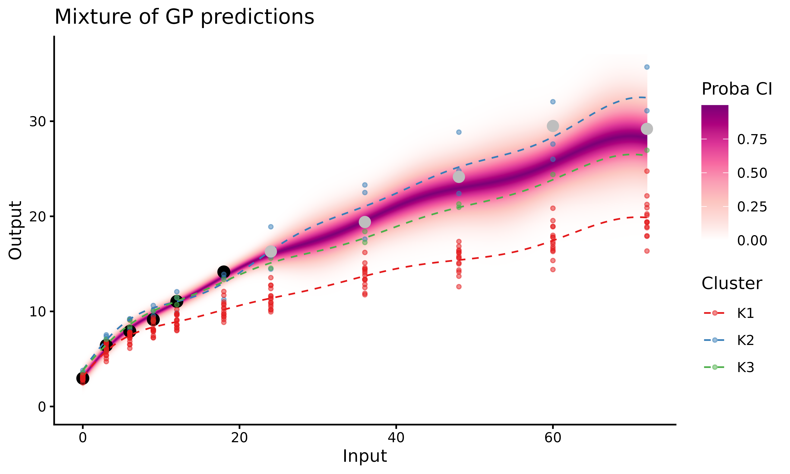
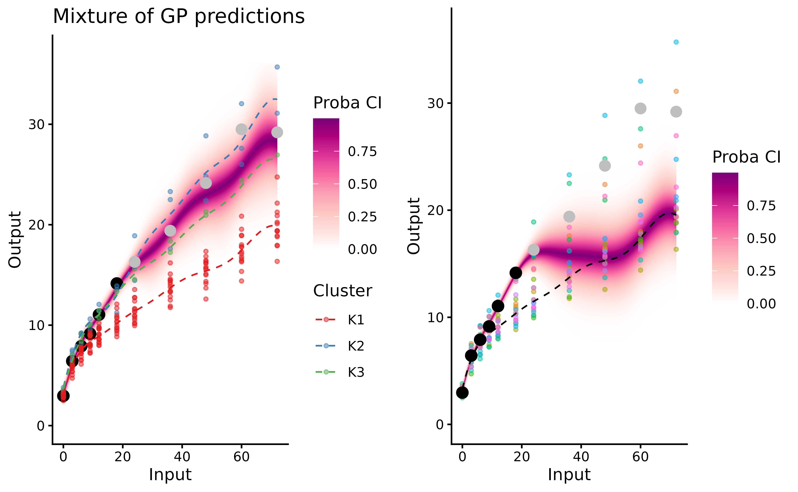

# How to use MagmaClust

``` r
library(MagmaClustR)
library(dplyr)
library(ggplot2)
if(rlang::is_installed("gridExtra")){library(gridExtra)}
```

## Data and purpose

### Context

To explore the features of MagmaClust, we use the `weight` dataset
available
[here](https://github.com/ArthurLeroy/MAGMAclust/blob/master/Real_Data_Study/Data/db_gusto_weight.csv),
coming from the GUSTO cohort study (<https://www.gusto.sg/>) and more
thoroughly studied [here](https://arxiv.org/abs/2011.07866)). This
dataset contains 3629 weight measurements of Singaporean children (174
boys and 168 girls, respectively).

Throughout this example, we use *MagmaClust* to model and forecast
evolution of children’s weight during early childhood. This extension of
the *Magma* model has been proposed to take into account the presence of
group structures in within data (a similar vignette for Magma is
available
[here](https://arthurleroy.github.io/MagmaClustR/articles/how-to-use-magma.html))
to enhance predictions.

More generally, our aim is to train a model on a dataset containing
multiple individuals and predict a new individual’s weight thanks to
shared information within clusters.

To get a better idea of the `weight` dataset content, we display an
illustration of the observed data for 5 children. Do the children’s
weights evolve the same, *i.e.* with the same pattern? Can we identify
group structures in the data, and define appropriate clusters? Those are
the kind of questions we aim to tackle in the following.

``` r
set.seed(10)
list_ID <- weight %>% pull(ID) %>%  sample()

ggplot2::ggplot(data=weight %>% filter(ID %in% list_ID[1:5]),
                ggplot2::aes(x=Input,y=Output,colour=factor(ID)))+
  ggplot2::geom_point(size=3) +
  ggplot2::theme_classic() +
  ggplot2::guides(colour="none")
```



This plot underlines the regularity of our functional data. The values
of weight are observed at the same ages for all children, as
measurements are collected in the context of a standardised cohort
study. Let us note that MagmaClust can also be used in the case of
irregular input grids without any change.

Overall, we can notice some differences in children profiles; some are
plump at birth before their weight gain slows down quickly, while others
may born slightly thinner but grow faster. Therefore, it might be
important to take these profiles into account if one wants to improve
the quality of weight predictions.

### Data formatting

The `weight` dataset contains 4 columns: `ID`, `sex`, `Input` and
`Output`. Each row corresponds to the weight measured for on child at a
given age. More specifically, each column contains: - `ID`, the
identifying number associated with each child; - `sex`, a factor
indicating the biological gender of the child (`Male` or `Female`); -
`Input`, the age of the child (in months); - `Output`, the weight of the
child (in kilograms).

``` r
knitr::kable(head(weight)) 
```

| ID        | sex    | Input | Output |
|:----------|:-------|------:|-------:|
| 010-04004 | Female |     0 |  2.825 |
| 010-04004 | Female |     3 |  5.058 |
| 010-04004 | Female |     6 |  6.622 |
| 010-04004 | Female |     9 |  7.368 |
| 010-04004 | Female |    12 |  7.525 |
| 010-04004 | Female |    18 |  8.900 |

If new variables (such as height, morphology, percentage of muscle mass
…) would have been observed, any additional column would be treated as a
covariate, and thus result in a model with multi-dimensional inputs.

Before starting to use *MagmaClust*, we must ensure that our dataset
contains at least the three following mandatory columns with adequate
type: - `ID`: `character` or `factor`; - `Input`: `numeric`; - `Output`:
`numeric`.

Since the children weight is not particularly affected by gender between
0 and 5 years old, we chose to maintain all individuals in the same
dataset. Therefore, the `sex` column is below removed for simplicity.

``` r
weight <- weight %>% select(-sex)
```

## Classical pipeline

The overall process of the *MagmaClust* algorithm can be decomposed in 3
main steps: **training, prediction** and **display of results**. The
corresponding functions are:

- [`train_magmaclust()`](https://arthurleroy.github.io/MagmaClustR/reference/train_magmaclust.html)
- [`pred_magmaclust()`](https://arthurleroy.github.io/MagmaClustR/reference/pred_magmaclust.html)
- [`plot_magmaclust()`](https://arthurleroy.github.io/MagmaClustR/reference/plot_magmaclust.html)

## Apply MagmaClust on the weight database

### Data organisation

Once the data organisation step is done, we randomly select two types of
children:

- those we use to train the model;
- the one for whom we predict future performances; let’s give her the
  fictive name *James*.

To limit computation time in this illustrative example, we randomly
select 20 children for training. Even if the performances of
*MagmaClust* increase with the number of training individuals, 20 are
more than enough to get a clear idea of how the algorithm works.

``` r
weight_train <- weight %>% filter(ID %in% list_ID[1:20])
weight_pred <- weight %>% filter(ID == list_ID[261]) %>% filter(Input<20)
weight_test <- weight %>% filter(ID == list_ID[261]) %>% filter(Input>20)
```

``` r
ggplot2::ggplot(data = weight_train,
       mapping = ggplot2::aes(x=Input,y=Output,colour=factor(ID)))+
  ggplot2::geom_point(size=1.5,alpha=0.3)+
  ggplot2::geom_point(data = weight_pred,
             size=3,
             shape=17,
             col="black") +
  ggplot2::theme_classic() +
  ggplot2::guides(colour="none")
```



The triangles correspond to James’ weight at different ages, whereas the
coloured dots are the children’ data we use for training.

### Training

It’s now time to train the model thanks to
[`train_magmaclust()`](https://arthurleroy.github.io/MagmaClustR/reference/train_magmaclust.md),
for which several arguments can be specified:

- `nb_cluster`: as for any clustering method, we have to provide a
  number *K* of clusters as an hypothesis of the model. For illustration
  purposes, we arbitrarily set $K = 3$ in the following example.
  However, a dedicated model selection method based on maximising a VBIC
  criterion is provided in the package as
  [`select_nb_cluster()`](https://arthurleroy.github.io/MagmaClustR/reference/select_nb_cluster.html).

- `kern`: the relationship between observed data and prediction targets
  can be control through the covariance **kernel**. Therefore, in order
  to correctly fit our data, we need to choose a suitable covariance
  kernel. In the case of swimmers, we want a smooth progression curve
  for James; therefore, we specify `kern = "SE"`.

The most commonly used kernels and their properties are discussed in
[the kernel cookbook](https://www.cs.toronto.edu/~duvenaud/cookbook/).
Details of available kernels and how to combine them are available in
[`help(train_magma)`](https://arthurleroy.github.io/MagmaClustR/reference/train_magma.html).

- `common_hp_k`: here, we assume that the set of hyper-parameters is the
  same for each cluster by setting `common_hp_k = TRUE`. Thus, we
  suppose that all clusters share the same covariance structure. This
  property implies that the shapes and variations of the curves are
  assumed to be roughly identical from one cluster to another; the
  differentiation is mainly due to the mean values.

- `common_hp_i`: as we want to share information across children, we
  specify `common_hp_i = TRUE`. If this assumption may appear
  restrictive at first glance, it actually offers a valuable way to
  share common patterns between tasks.

As for any GP method, initialisation of the HP may have an influence on
the final optimisation and leads to inadequate prediction for
pathological cases. Therefore, users may explicitly define specific
initial values through the dedicated arguments: `ini_hp_k` and
`ini_hp_i`.

Other parameters can also be specified; see
[`help (train_magmaclust)`](https://arthurleroy.github.io/MagmaClustR/reference/train_magmaclust.html)
for details.

``` r
set.seed(10)
model_clust <- train_magmaclust(data = weight_train,
                        nb_cluster = 3,
                        kern_k = "SE",
                        kern_i = "SE",
                        common_hp_k = TRUE,
                        common_hp_i = TRUE)
#> The 'ini_hp_i' argument has not been specified. Random values of hyper-parameters for the individual processes are used as initialisation.
#>  
#> The 'ini_hp_k' argument has not been specified. Random values of hyper-parameters for the mean processes are used as initialisation.
#>  
#> The 'prior_mean' argument has not been specified. The hyper_prior mean function is thus set to be 0 everywhere.
#>  
#> VEM algorithm, step 1: 7.49 seconds 
#>  
#> Value of the elbo: -588.44662 --- Convergence ratio = Inf
#>  
#> VEM algorithm, step 2: 3.98 seconds 
#>  
#> Value of the elbo: -476.83441 --- Convergence ratio = 0.23407
#>  
#> VEM algorithm, step 3: 6.28 seconds 
#>  
#> Value of the elbo: -417.64055 --- Convergence ratio = 0.14173
#>  
#> VEM algorithm, step 4: 4.36 seconds 
#>  
#> Value of the elbo: -387.40281 --- Convergence ratio = 0.07805
#>  
#> VEM algorithm, step 5: 3.66 seconds 
#>  
#> Value of the elbo: -382.57575 --- Convergence ratio = 0.01262
#>  
#> VEM algorithm, step 6: 4.58 seconds 
#>  
#> Value of the elbo: -380.80081 --- Convergence ratio = 0.00466
#>  
#> VEM algorithm, step 7: 3.05 seconds 
#>  
#> Value of the elbo: -379.39134 --- Convergence ratio = 0.00372
#>  
#> VEM algorithm, step 8: 3.06 seconds 
#>  
#> Value of the elbo: -378.41461 --- Convergence ratio = 0.00258
#>  
#> VEM algorithm, step 9: 3.06 seconds 
#>  
#> Value of the elbo: -377.39036 --- Convergence ratio = 0.00271
#>  
#> VEM algorithm, step 10: 3.08 seconds 
#>  
#> Value of the elbo: -376.41644 --- Convergence ratio = 0.00259
#>  
#> VEM algorithm, step 11: 2.97 seconds 
#>  
#> Value of the elbo: -375.60006 --- Convergence ratio = 0.00217
#>  
#> VEM algorithm, step 12: 3.05 seconds 
#>  
#> Value of the elbo: -374.95889 --- Convergence ratio = 0.00171
#>  
#> VEM algorithm, step 13: 3.03 seconds 
#>  
#> Value of the elbo: -374.37301 --- Convergence ratio = 0.00156
#>  
#> VEM algorithm, step 14: 3.04 seconds 
#>  
#> Value of the elbo: -373.87343 --- Convergence ratio = 0.00134
#>  
#> VEM algorithm, step 15: 3.02 seconds 
#>  
#> Value of the elbo: -373.39528 --- Convergence ratio = 0.00128
#>  
#> VEM algorithm, step 16: 3.06 seconds 
#>  
#> Value of the elbo: -372.92681 --- Convergence ratio = 0.00126
#>  
#> VEM algorithm, step 17: 3.2 seconds 
#>  
#> Value of the elbo: -372.48574 --- Convergence ratio = 0.00118
#>  
#> VEM algorithm, step 18: 3.33 seconds 
#>  
#> Value of the elbo: -372.14595 --- Convergence ratio = 0.00091
#>  
#> The EM algorithm successfully converged, training is completed. 
#> 
```

### Prediction for James

As the *MagmaClust* model is trained, we can now predict the evolution
of James’ weight. To perform prediction, we need to specify two main
parameters in the
[`pred_magmaclust()`](https://arthurleroy.github.io/MagmaClustR/reference/pred_magmaclust.md)
function:

- `data`, in our case, the sub-dataset containing James’ past weight;
- `trained_model`, which corresponds to the model we just trained with
  the other 20 children

Let us mention that we aim to study weight curves during early
childhood, and compare our predictions to the true values observed in
the dataset. Therefore, the evolution of James’ weight is predicted
between 0 and 6 years (72 months), using only the his weight data from 0
to 20 months. Therefore, the argument `grid_inputs = seq(0,72,0.1)`.

``` r
pred_clust <- pred_magmaclust(data = weight_pred,
                              trained_model = model_clust,
                              grid_inputs = seq(0,72,0.1),
                              plot = FALSE,
                              get_hyperpost = TRUE)
#> The hyper-posterior distribution of the mean process provided in 'hyperpost' argument isn't evaluated on the expected inputs. Start evaluating the hyper-posterior on the correct inputs...
#>  
#> Done!
#> 
```

Here we specified `get_hyperpost = TRUE` (to return the hyper-posterior
distribution of all mean processes) as it will allow us to plot the
average GP of each cluster in the
[`plot_magmaclust()`](https://arthurleroy.github.io/MagmaClustR/reference/plot_magmaclust.md)
function. However, we do not need it if we merely need to display the
prediction of our individual.

### Plots

With the
[`plot_magmaclust()`](https://arthurleroy.github.io/MagmaClustR/reference/plot_magmaclust.html)
function, we can display the prediction for the evolution of James’
weight over time.

``` r
plot_magmaclust(pred = pred_clust,
                data = weight_pred,
                prior_mean = pred_clust$hyperpost$mean,
                data_train = weight_train,
                size_data = 5)
```



In the above figure, we can observe:

- James’ evolution curve (purple line) expressed as a mixture of GPs;

- the training data points in the background (displayed through
  `data_train`). Each colour corresponds to one child;

- the trained mean processes as dashed (blue, red and green) lines
  coming from the `prior_mean` parameter.

## Customise graphs

In order to customise the graphical representations of results, we first
need to distinguish 2 cases:

- James belongs to one of the clusters with probability 1 (or really
  close). We can then display the mean curve along its associated 95%
  credibility interval;

- James has non-null probabilities in several clusters; therefore, its
  evolution curve is defined as a Gaussian mixture (which is not
  unimodal in general). In this case, we cannot define an associated
  credibility interval. However, the uncertainty quantification can
  still be displayed using a heatmap of probabilities. To control the
  colour pixel ratio of the heatmap, one can define an appropriate
  vector for the `y_grid` argument.

We can also display training individuals in the same colour as their
most probable cluster by using the
[`data_allocate_cluster()`](https://arthurleroy.github.io/MagmaClustR/reference/data_allocate_cluster.html)
function beforehand, and specifying the following arguments:
`data_train = data_train_with_clust` and `col_clust = TRUE`. In order to
evaluate the quality of the prediction, we can also represent (in grey
below) the true observations for this individual, which we didn’t use in
the algorithm and kept in the `weight_test` variable for testing
purposes.

``` r
data_train_with_clust = data_allocate_cluster(model_clust)

plot_magmaclust(pred = pred_clust,
                cluster = "all",
                data = weight_pred,
                data_train = data_train_with_clust,
                prior_mean = pred_clust$hyperpost$mean,
                heatmap = TRUE,
                y_grid = seq(0,37,0.1),
                col_clust = TRUE,
                size_data = 5) + 
  ggplot2::geom_point(data = weight_test,
                      ggplot2::aes(x = Input, y = Output),
                      color = 'grey', size = 3)
```



#### MagmaClust vs Magma

The MagmaClustR package also provides an implementation for the *Magma*
algorithm, allowing us to compare *MagmaClust* and *Magma* predictions.
For more details on Magma, see the dedicated
[vignette](https://arthurleroy.github.io/MagmaClustR/articles/how-to-use-magma.html).

The graphs below correspond to James’ weight prediction with MagmaClust
(left) and Magma (right).



On intervals of unobserved timestamps containing data points from the
training dataset ($t \in \rbrack 20,72\rbrack$), Magma takes advantage
of its multi-task component to share knowledge across individuals by
estimating a unique mean process. However, this unique mean process
appears unable to recover accurately the evolution trend. In this
example, *MagmaClust* offers a significant improvement in this long term
(more than 4 years ahead) forecasting task. By leveraging group
structures among children, the algorithm shares more knowledge across
individual that are similar, resulting in more precise and specific
predictions based on a mixture of GPs.

## Reference

Overall, the multi-task framework combined with a clustering component
provided by *MagmaClust* offers reliable probabilistic predictions for a
new individual (child in our example) on a wide range of timestamps.
Moreover, the uncertainty quantification inherent to GP-based methods
allows practitioners to maintain an adequate degree of caution in their
decision making process.

For further details, the complete derivation of the algorithm and
experiments are published and available in [Cluster-Specific Predictions
with Multi-Task Gaussian
Processes](https://jmlr.org/papers/v24/20-1321.html).
