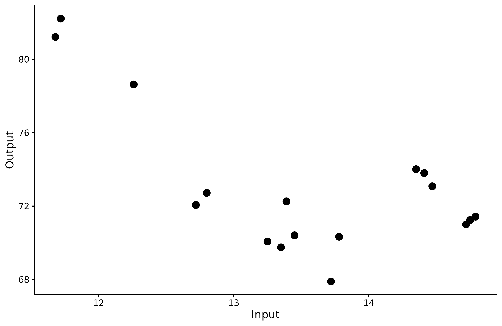
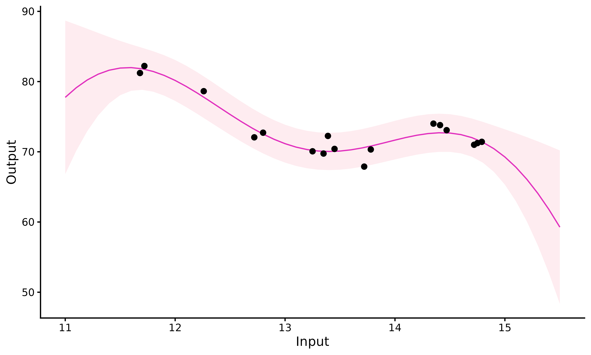

# Gaussian Process regression

``` r
library(MagmaClustR)
library(dplyr)
library(ggplot2)
```

## Classical pipeline

The overall pipeline for standard GP regression in *MagmaClustR* can be
decomposed in 3 main steps: **training, prediction** and **plotting of
results**. The corresponding functions are:

- [`train_gp()`](https://arthurleroy.github.io/MagmaClustR/reference/train_magma.html)
- [`pred_gp()`](https://arthurleroy.github.io/MagmaClustR/reference/pred_gp.html)
- [`plot_gp()`](https://arthurleroy.github.io/MagmaClustR/reference/plot_gp.html)

## Data

### Dataset format

Before using
[`train_gp()`](https://arthurleroy.github.io/MagmaClustR/reference/train_gp.md),
our dataset should present a particular format. It must contains those 2
columns:

- `Input`: `numeric`,
- `Output`: `numeric`.

If we fail to ensure that the dataset satisfies those conditions, the
algorithm will return an error.

The data frame can also provide as many covariates (*i.e.* additional
columns) as desired, with no constraints on the column names (except the
name ‘Reference’ that should always be avoided, as it is used inside
internal functions of the algorithm). These covariates are treated as
additional input dimensions.

### Example with swimming data

To explore the features of standard GP in *MagmaClustR*, we use the
`swimmers` dataset provided by the French Swimming Federation (available
[here](https://github.com/ArthurLeroy/MAGMAclust/blob/master/Real_Data_Study/Data/db_100m_freestyle.csv),
and studied more thoroughly
[here](https://link.springer.com/article/10.1007/s10994-022-06172-1) and
[there](https://arxiv.org/abs/2011.07866)).

Our goal is to model the progression curves of swimmers in order to
forecast their future performances. Thus, we randomly select a female
swimmer from the dataset; let’s give her the fictive name *Michaela* for
the sake of illustration.

The `swimmers` dataset contains 4 columns: `ID`, `Age`, `Performance`
and `Gender`. Therefore, we first need to change the name and type of
the columns, and remove `Gender` before using
[`train_gp()`](https://arthurleroy.github.io/MagmaClustR/reference/train_gp.md).

``` r
Michaela <- swimmers %>% filter(ID == 1718) %>% 
  select(-Gender) %>% 
  rename(Input = Age, Output = Performance)
```

We display Michaela’s performances according to her age to visualise her
progression from raw data.

``` r
ggplot() +
  geom_point(data = Michaela,
       mapping = aes(x=Input,y=Output),
       size = 3,
       colour = "black") +
  theme_classic()
```



## Fit a GP on Michaela’s data points

### Training

To obtain a GP that best fits our data, we must specify some parameters:

- `prior_mean`: if we assume no *prior* knowledge about the 100m
  freestyle, we can decide to leave the default value for this parameter
  (*i.e.* zero). However, if we want to take expert advice into account,
  we can modify the value of `prior_mean` accordingly.

- `kern`: the relationship between observed data and prediction targets
  can be control through the covariance **kernel**. Therefore, in order
  to correctly fit our data, we need to choose a suitable covariance
  kernel. In the case of swimmers, we want a smooth progression curve
  for Michaela; therefore, we specify `kern = "SE"`.

The most commonly used kernels and their properties are covered in [the
kernel cookbook](https://www.cs.toronto.edu/~duvenaud/cookbook/).
Details of available kernels and how to combine them in *MagmaClustR*
are available in
[`help(train_gp)`](https://arthurleroy.github.io/MagmaClustR/reference/train_gp.html).

``` r
set.seed(2)
model_gp <- train_gp(data = Michaela,
                     kern = "SE",
                     prior_mean = 0)
#> The provided 'prior_mean' argument is of length 1. Thus, the hyper-posterior mean function has set to be constant everywhere. 
#>  
#> The 'ini_hp' argument has not been specified. Random values of hyper-parameters are used as initialisation.
#> 
```

Thanks to
[`train_gp()`](https://arthurleroy.github.io/MagmaClustR/reference/train_gp.md),
we learn the model hyper-parameters from data, which can then be used to
make prediction for Michaela’s performances.

### GP prediction

The arguments `kern` and `mean` remain the same as above. We now need to
specify:

- the hyper-parameters obtained with
  [`train_gp()`](https://arthurleroy.github.io/MagmaClustR/reference/train_gp.md)
  in `hp`;
- the input values on which we want to evaluate our GP in `grid_inputs`.
  Here, we want to predict Michaela’s performances until 15/16 years
  old, so we set `grid_inputs = seq(11, 15.5, 0.1)`.

See
[`help(pred_gp)`](https://arthurleroy.github.io/MagmaClustR/reference/pred_gp.html)
to get information about the other optional arguments.

``` r
pred_gp <- pred_gp(data = Michaela,
                   kern = "SE",
                   hp = model_gp,
                   grid_inputs = seq(11,15.5,0.1),
                   plot = FALSE) 
#> The 'mean' argument has not been specified. The  mean function is thus set to be 0 everywhere.
#> 
```

Let us note that we could have called the
[`pred_gp()`](https://arthurleroy.github.io/MagmaClustR/reference/pred_gp.md)
function directly on data. If we didn’t use the
[`train_gp()`](https://arthurleroy.github.io/MagmaClustR/reference/train_gp.md)
function beforehand, it is possible to omit the `hp` parameter;
[`pred_gp()`](https://arthurleroy.github.io/MagmaClustR/reference/pred_gp.md)
would automatically learn hyperparameters with default settings and us
them to make predictions afterwards.

### Plotting the results

Finally, we display Michaela’s prediction curve and its 95% associated
credibility interval thanks to the
[`plot_gp()`](https://arthurleroy.github.io/MagmaClustR/reference/plot_gp.md)
function. If we want to get a prettier graphic, we could specify
`heatmap = TRUE` to create a heatmap of probabilities instead (note that
it could be longer to display when evaluating on fine grids).

``` r
plot_gp(pred_gp = pred_gp,
        data = Michaela)
```



Close to Michaela’s observed data ($t \in \lbrack 10,14\rbrack$), the
standard GP prediction behaves as expected: it accurately fits data
points and the confidence interval is narrow. However, as soon as we
move away from observed points, the GP drifts to the **prior mean** and
uncertainty increases significantly.
